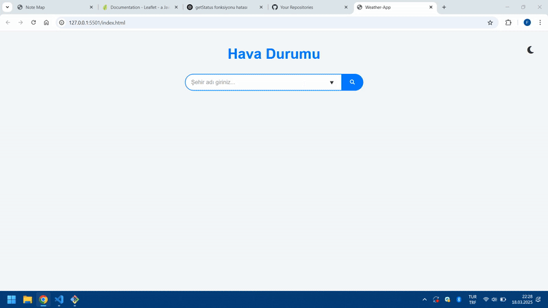

<h1>Weather_App </h1>

Bu, kullanıcıların anlık hava durumu verilerine erişebileceği basit bir hava durumu uygulamasıdır. Uygulama, bir hava durumu API'si kullanarak kullanıcıların belirttiği konum için hava durumu bilgilerini alır ve görsel olarak kullanıcıya sunar.

<h2>Özellikler</h2>

Hava Durumu Görüntüleme: Kullanıcılar, belirledikleri şehir için anlık hava durumu verilerini görüntüleyebilir.

Sıcaklık, Nem ve Hız: Uygulama, şehir için sıcaklık, nem oranı ve rüzgar hızı gibi verileri gösterir.

API Entegrasyonu: Gerçek hava durumu verisi, bir hava durumu API'si aracılığıyla alınır (örneğin, OpenWeatherMap API'si).

Mobil Uyumluluk: Uygulama, mobil cihazlarla uyumludur ve responsive tasarıma sahiptir.

<h2>Ekran Görüntüsü</h2>

